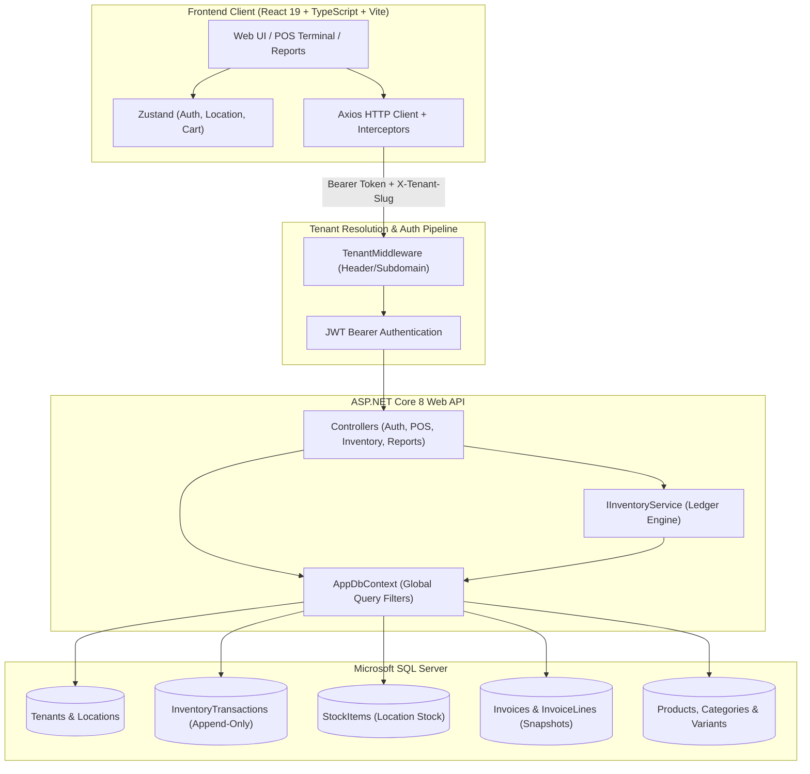

# Vikreta (विक्रेता) — Multi-Tenant Cloud POS & Inventory System

[](https://dotnet.microsoft.com/)
[](https://react.dev/)
[](https://www.typescriptlang.org/)
[](https://vitejs.dev/)
[](https://tailwindcss.com/)
[](https://learn.microsoft.com/ef/core/)
[](https://www.microsoft.com/sql-server)

**Vikreta** (Sanskrit/Hindi for *"Merchant"* or *"Seller"*) is a high-performance, cloud-native Point of Sale (POS), multi-location inventory ledger, and retail intelligence platform. Engineered for retail chains, cafes, and multi-store franchises, it delivers true multi-tenancy, immutable stock movement auditability, instant cashier operations, and deep financial reporting.

---

## 🌟 Key Features

- 🏢 **Multi-Tenant Architecture**: Shared-database, isolated-schema multi-tenancy enforced automatically via EF Core global query filters. Tenants resolve seamlessly from headers (`X-Tenant-Slug`, `X-Tenant-Id`) or subdomain routing.
- ⚡ **High-Speed POS Terminal**:
  - Grid-based catalog browsing with instant category filtering.
  - Barcode scanner auto-capture with global keyboard focus.
  - Interactive cart drawer with item quantity steppers, discount overrides, and real-time tax calculation.
  - One-click multi-method checkout (Cash, Card, Store Credit) with automatic stock deduction and invoice generation.
- 📦 **Immutable Inventory Ledger**:
  - Append-only `InventoryTransactions` record every stock delta (Sales, Purchases, Shrinkage/Damages, Store Transfers, Adjustments).
  - Multi-location stock levels with low-stock warnings and reorder thresholds.
  - Inter-store stock transfer workflows (`Pending` ➔ `InTransit` ➔ `Received`).
- 🧾 **Frozen Snapshot Billing**:
  - Invoice lines freeze product names, variant attributes, unit costs, unit prices, and tax rates at the exact time of sale.
  - Catalog price changes never corrupt historical receipts or accounting records.
  - Payment records with partial payments, balance tracking, and voiding with automatic inventory restoration.
- 👥 **CRM & Supplier Purchasing**:
  - Customer directory tracking purchase history and store credit balances.
  - Supplier profiles linked to purchase order lifecycles (`Draft` ➔ `Ordered` ➔ `Received`).
- 📊 **Executive Analytics & Reporting**:
  - Interactive Sales Trends with location breakdown and revenue charts (Recharts).
  - Real-time Stock Valuation ($ / ₹ at cost and retail).
  - Top-selling products ranked by volume and revenue contribution.
  - Tax Summary report grouped by tax bracket.
- 🛡️ **Role-Based Access Control (RBAC)**:
  - Strict hierarchical permissions for `Owner`, `Manager`, and `Cashier` roles.
  - Passwords salted and hashed with BCrypt; authenticated via stateless JWT Bearer tokens.

---

## 📐 System Architecture



---

## 💻 Tech Stack

### Backend
- **Framework**: ASP.NET Core 8.0 (C# 12)
- **Data Access**: Entity Framework Core 8.0 (`Microsoft.EntityFrameworkCore.SqlServer`)
- **Database**: Microsoft SQL Server / LocalDB
- **Authentication**: JWT Bearer Tokens (`System.IdentityModel.Tokens.Jwt`) + BCrypt.Net-Next
- **Validation & Mapping**: FluentValidation, AutoMapper
- **API Documentation**: OpenAPI / Swagger UI

### Frontend
- **Framework**: React 19 + TypeScript 5
- **Build Tool**: Vite 8
- **Styling**: Tailwind CSS 3.4 (Tailwind Forms, Custom design tokens)
- **State Management**: Zustand 5 (with `persist` middleware for session & active location)
- **Data Fetching**: TanStack Query v5 (React Query)
- **Routing**: React Router DOM v7
- **Charts & Data Viz**: Recharts 3
- **Icons & Notifications**: Lucide React, React Hot Toast

---

## 📂 Repository Structure

```
Vikreta/
├── plan/                              # Architecture specifications & design mockups
│   ├── Vikreta-Plan.md                # Full implementation plan & schema specification
│   ├── dashboard-mockup-color.html    # Executive dashboard visual mockup
│   └── pos-mockup-color.html          # Point of sale visual mockup
│
├── src/
│   ├── Vikreta.Api/                   # ASP.NET Core 8 Web API
│   │   ├── Controllers/               # REST API Controllers
│   │   │   ├── AuthController.cs
│   │   │   ├── CatalogController.cs
│   │   │   ├── InvoicesController.cs
│   │   │   ├── InventoryController.cs
│   │   │   ├── CustomersSuppliersController.cs
│   │   │   └── ReportsAndAdminController.cs
│   │   ├── Domain/                    # Domain entities & enum definitions
│   │   │   ├── Entities.cs
│   │   │   └── Enums.cs
│   │   ├── DTOs/                      # Data Transfer Objects & request models
│   │   ├── Infrastructure/            # Persistence & multi-tenancy
│   │   │   ├── AppDbContext.cs        # EF Core DbContext with query filters
│   │   │   ├── AppDbContextFactory.cs # Design-time factory for EF migrations
│   │   │   ├── DbSeeder.cs            # Initial tenant & demo data seeder
│   │   │   └── TenantContext.cs       # Scoped tenant resolution context
│   │   ├── Middleware/                # TenantMiddleware pipeline
│   │   ├── Services/                  # Business logic (InventoryService ledger)
│   │   ├── Migrations/                # EF Core database migrations
│   │   ├── appsettings.json           # Connection strings & JWT config
│   │   └── Program.cs                 # Application bootstrap & dependency injection
│   │
│   └── vikreta-web/                   # React + TypeScript + Vite frontend
│       ├── src/
│       │   ├── api/                   # Typed Axios API client & endpoints
│       │   ├── components/            # Shared UI components (DataTable, Modal, etc.)
│       │   ├── layouts/               # AppShell (Sidebar, TopBar, LocationSwitcher)
│       │   ├── modules/               # Feature pages & routes
│       │   │   ├── auth/              # Login & Forgot Password
│       │   │   ├── dashboard/         # Executive Dashboard
│       │   │   ├── pos/               # POS Terminal & Fast Checkout
│       │   │   ├── catalog/           # Products & Categories
│       │   │   ├── inventory/         # Stock Levels, Adjustments & Transfers
│       │   │   ├── invoices/          # Invoices & Invoice Detail
│       │   │   ├── customers/         # Customers & Store Credit
│       │   │   ├── suppliers/         # Suppliers & Purchase Orders
│       │   │   ├── reports/           # Sales, Valuation, Top Products, Taxes
│       │   │   └── admin/             # Locations, Users & Settings
│       │   ├── stores/                # Zustand stores (auth, location, cart)
│       │   ├── App.tsx                # Client routing & ProtectedRoute guard
│       │   ├── index.css              # Custom Tailwind tokens & design system
│       │   └── main.tsx               # Frontend entrypoint
│       ├── .env                       # Local environment variables (API URL)
│       └── package.json
│
└── README.md
```

---

## 🚀 Quick Start Guide

### Prerequisites
1. **.NET 8 SDK**: [Download .NET 8](https://dotnet.microsoft.com/download/dotnet/8.0)
2. **Node.js**: v18.0.0 or higher ([Download Node.js](https://nodejs.org/))
3. **SQL Server**: SQL Server LocalDB (included with Visual Studio) or SQL Server Express/Developer/Standard.

---

### Step 1: Database Setup & Backend API

1. Navigate to the backend directory:
   ```powershell
   cd d:\Vikreta\src\Vikreta.Api
   ```

2. Verify or modify the connection string in `appsettings.json` if needed:
   ```json
   "ConnectionStrings": {
     "Default": "Server=(localdb)\\mssqllocaldb;Database=VikretaDb;Trusted_Connection=True;MultipleActiveResultSets=true"
   }
   ```

3. Run the database migration:
   ```powershell
   dotnet ef database update
   ```

4. Start the API server:
   ```powershell
   dotnet run --launch-profile http
   ```
   The backend API will start on:
   - **API Base URL**: `http://localhost:5010`
   - **Interactive Swagger UI**: `http://localhost:5010/swagger`

*(Note: On initial startup, the database is automatically seeded with demo data: 1 tenant, 2 store locations, 3 users, categories, products, and inventory stock.)*

---

### Step 2: Frontend Client

1. Open a new terminal and navigate to the frontend directory:
   ```powershell
   cd d:\Vikreta\src\vikreta-web
   ```

2. Install dependencies (if not already installed):
   ```powershell
   npm install
   ```

3. Verify `d:\Vikreta\src\vikreta-web\.env` points to the running backend:
   ```env
   VITE_API_URL=http://localhost:5010
   ```

4. Launch the Vite development server:
   ```powershell
   npm run dev
   ```
   The web application will be accessible at:
   - **Web App**: `http://localhost:5173`

---

## 🔑 Pre-Seeded Demo Accounts

When the database initializes, the following credentials are ready for testing:

| Role | Tenant Slug | Email | Password | Assigned Location |
| :--- | :--- | :--- | :--- | :--- |
| **Owner** | `demo` | `owner@demo.com` | `password123` | *All Locations (Global)* |
| **Manager** | `demo` | `manager@demo.com` | `password123` | Downtown Store |
| **Cashier** | `demo` | `cashier@demo.com` | `password123` | Downtown Store |

### Default Locations Seeded
1. **Downtown Store** (`Asia/Kolkata`)
2. **Riverside Store** (`Asia/Kolkata`)

---

## 📡 REST API Reference

All requests outside `/api/auth/*` require:
- Header: `Authorization: Bearer <JWT_TOKEN>`
- Header: `X-Tenant-Slug: <slug>` *(e.g., `demo`)* or `X-Tenant-Id: <GUID>`

### Authentication
- `POST /api/auth/login` — Login with tenant slug, email, and password. Returns JWT token and user profile.
- `GET  /api/auth/me` — Retrieve current authenticated user session.

### Locations & Settings
- `GET  /api/locations` — List store locations for tenant.
- `POST /api/locations` — Create new store location.
- `GET  /api/settings` — Get tenant receipt branding and tax settings.
- `PUT  /api/settings` — Update tenant settings.

### Catalog
- `GET    /api/products` — Search & list products (supports pagination, category filter, SKU/barcode search).
- `GET    /api/products/{id}` — Get single product details with variants.
- `POST   /api/products` — Create product with inventory tracking options.
- `PUT    /api/products/{id}` — Update product details.
- `GET    /api/categories` — List all categories with color badges and hierarchy.
- `POST   /api/categories` — Create category.

### Inventory & Stock Movement
- `GET  /api/stock` — Query stock levels by location, with low-stock alerts.
- `POST /api/stock/adjust` — Record manual stock adjustment (counts, damages, shrinkage).
- `GET  /api/stock-transfers` — List inter-location stock transfers.
- `POST /api/stock-transfers` — Initiate new stock transfer.
- `POST /api/stock-transfers/{id}/send` — Mark transfer as in-transit.
- `POST /api/stock-transfers/{id}/receive` — Complete stock transfer and credit receiving location.

### Billing & POS
- `GET  /api/invoices` — Query invoice ledger with date range, status, and location filters.
- `GET  /api/invoices/{id}` — Get complete invoice breakdown (frozen lines, payments, audit info).
- `POST /api/invoices` — Create invoice, snapshot product pricing/tax, and decrement inventory ledger.
- `POST /api/invoices/{id}/payments` — Record payment against invoice (`Cash`, `Card`, `StoreCredit`).
- `POST /api/invoices/{id}/void` — Void invoice and automatically reverse inventory deductions.

### CRM & Purchasing
- `GET  /api/customers` — List customers and store credit balances.
- `POST /api/customers` — Register customer.
- `POST /api/customers/{id}/credit` — Add/deduct customer store credit.
- `GET  /api/suppliers` — List suppliers.
- `POST /api/suppliers` — Register supplier.
- `GET  /api/purchase-orders` — List purchase orders.
- `POST /api/purchase-orders` — Create purchase order.
- `POST /api/purchase-orders/{id}/receive` — Receive PO goods and increment inventory.

### Analytics & Reports
- `GET /api/dashboard` — KPI summary (today sales, transactions, low-stock count, active stores).
- `GET /api/reports/sales` — Daily sales totals and location breakdown.
- `GET /api/reports/stock-valuation` — Valuation of on-hand stock at cost and retail.
- `GET /api/reports/top-products` — Top selling products ranked by revenue and units.
- `GET /api/reports/tax-summary` — Tax collections grouped by tax percentage.

---

## 🎨 Design System & Aesthetics

Vikreta implements a curated, cohesive color palette tailored for retail clarity and reduced cashier fatigue:

| Token | Hex | Role | Usage |
| :--- | :--- | :--- | :--- |
| **Persian Red** | `#C8443C` | Primary Brand / Urgent | Main logo mark, void actions, primary CTA |
| **Deep Teal** | `#1D7874` | Secondary / Success | Active store pill, paid status, POS charge button |
| **Warm Amber** | `#E8A33D` | Warning / Attention | Low stock alert, partially paid badges, bakery cat |
| **Amethyst Purple**| `#6B4E71` | Accent / Categories | Retail category tags, customer credit highlights |
| **Deep Ink** | `#0D0F11` | Text & UI Headings | High-contrast typography and table headers |
| **Surface Line** | `#E5E7EB` | Dividers & Borders | Subtle card boundaries and table row borders |
| **Background** | `#F8F9FA` | Canvas Background | Neutral eye-friendly viewport canvas |

---

## 🔒 Security & Data Isolation

1. **Query Filter Isolation**:
   Every tenant-specific entity implements a global query filter:
   ```csharp
   modelBuilder.Entity<Invoice>()
       .HasQueryFilter(e => _tenantContext.TenantId == Guid.Empty || e.TenantId == _tenantContext.TenantId);
   ```
   This guarantees that even if a developer omits a `Where(x => x.TenantId == ...)` clause in a query, data from other tenants can **never** leak.
2. **Preventing SQL Server Cascade Cycles**:
   Foreign key relationships default to `DeleteBehavior.Restrict`, with explicit cascade rules reserved strictly for parent-child aggregate boundaries (`Invoice` ➔ `InvoiceLines`, `PurchaseOrder` ➔ `PurchaseOrderLines`).
3. **Password Security**:
   Passwords are never stored in plaintext. They are hashed using `BCrypt.Net-Next` with automatic work factor salt generation.

---

## 🛠️ Testing & Verification

### Running Automated Type Checks
```powershell
cd d:\Vikreta\src\vikreta-web
npx tsc --noEmit
```

### Running Backend Build
```powershell
cd d:\Vikreta\src\Vikreta.Api
dotnet build
```

---

## 📄 License

This project is licensed under the MIT License — see the [LICENSE](LICENSE) file for details.
