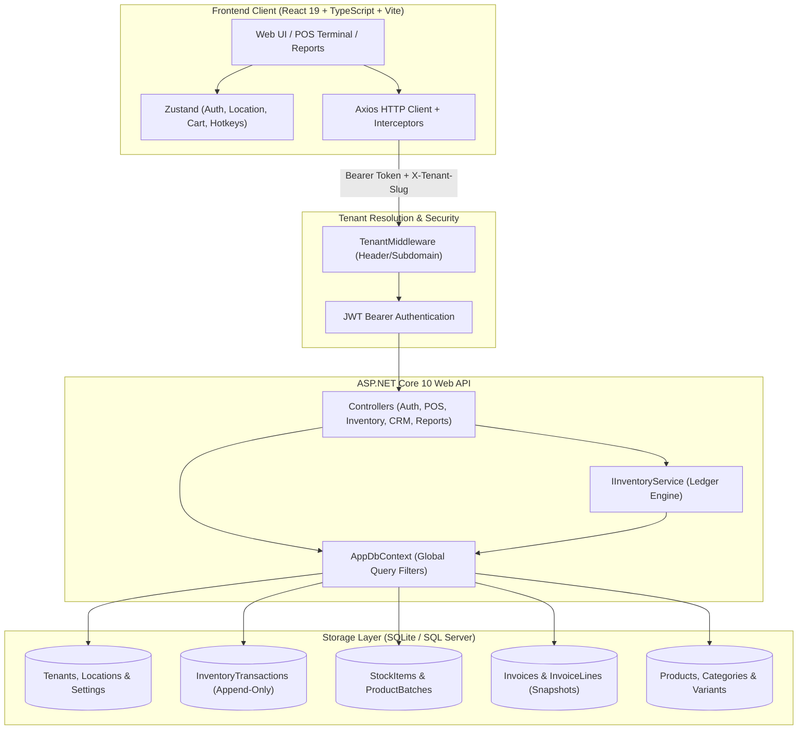

# Vikreta (विक्रेता) — Modern Multi-Tenant Cloud POS & Retail Intelligence Platform

[](https://dotnet.microsoft.com/)
[](https://react.dev/)
[](https://www.typescriptlang.org/)
[](https://vitejs.dev/)
[](https://tailwindcss.com/)
[](https://learn.microsoft.com/ef/core/)
[](#-dynamic-upi-qr-codes)

**Vikreta** (Sanskrit/Hindi for *"Merchant"* or *"Seller"*) is an enterprise-ready, high-speed Point of Sale (POS), multi-location inventory ledger, and retail intelligence platform. Engineered for modern retail shops, supermarkets, FMCG stores, cafes, and multi-store franchises, it delivers true multi-tenancy, immutable stock auditability, lightning-fast cashier checkouts, real-time UPI QR payments, and deep financial analytics.

---

## 🌟 Key Features

### ⚡ High-Speed POS Counter Checkout
- **Keyboard Shortcuts for High-Volume Checkouts**:
  - `F1`: Shortcuts guide cheat-sheet.
  - `F2`: Instantly focus and select barcode / product search input.
  - `F4`: One-touch Pay and complete transaction.
  - `Space`: Select Cash payment method.
  - `F8`: Park/Hold active sale for the next waiting customer.
  - `F9`: Open parked carts modal to resume suspended orders.
  - `Esc`: Clear current cart or dismiss open modals.
  - **Auto-Capture Scanner**: Typing anywhere outside inputs automatically redirects focus directly into the barcode scanner input.
- **Dynamic UPI QR Code Payments**:
  - Generates scannable, dynamic UPI QR codes directly on the billing screen (`upi://pay?pa=...&pn=...&am=...&cu=INR`).
  - Compatible with all Indian UPI apps (Google Pay, PhonePe, Paytm, BHIM, Navi, Cred).
  - Store UPI VPA / ID and merchant name configurable via Store Settings.
  - Instant one-click cashier payment confirmation.
- **Cash Change Calculator**:
  - Real-time change calculator with quick denomination tender buttons (`Exact`, `+₹50`, `+₹100`, `+₹500`, `+₹2000`).
  - Eliminates mental math errors and speeds up physical cash handling.
- **Hold & Park Carts**:
  - Park active carts with a single keystroke (`F8`) when customers step away or need additional items.
  - Dedicated badge counter showing parked sales count with 1-click restore (`F9`).
- **Flexible Item & Cart Discounts**:
  - Apply percentage (`%`) or flat rupee (`₹`) discounts at the invoice level with real-time recalculation of taxes and line totals.
- **1-Click WhatsApp Bill Sharing**:
  - Instant paperless receipt sharing via WhatsApp (`https://wa.me/?text=...`) formatted with store name, invoice number, items list, taxes, and payment confirmation.
- **Adjustable Screen Splitter**:
  - Interactive draggable divider between catalog grid and cart invoice panel to adapt to widescreen POS monitors or compact touch terminals.

---

### 🎁 Customer Loyalty Points System
- **Owner-Configured Loyalty Rewards**:
  - Owner can toggle the loyalty program ON/OFF at any time in Store Settings (`/admin/settings`).
  - Customizable spend-to-points ratio (e.g. earn 1 point per ₹100 spent) and point redemption value (e.g. 1 point = ₹1.00).
- **POS Redemption**:
  - Selecting a customer in POS displays their current point balance and Rupee value.
  - Quick redemption modal with `25%`, `50%`, and `MAX` deduction shortcuts.
  - Redeemed points are deducted from the bill; net paid amount automatically accrues new points upon checkout.
- **CRM Ledger**:
  - View points balance directly on Customer directory and Customer profile page.
  - Manual adjustments with mandatory audit reason logging (`PATCH /api/customers/{id}/loyalty`).

---

### 🏷️ Barcode Sticker Generator & Label Printing
- **In-App Barcode Generation**:
  - Select any product from Catalog or Product Detail to generate high-density **Code 128** barcode stickers.
  - Compatible with any 1D/2D laser, CCD, or handheld retail scanner.
- **Multiple Sheet & Thermal Layouts**:
  - **A4 24-Up** (3 × 8 layout · 70 × 37 mm)
  - **A4 30-Up** (3 × 10 layout · 70 × 29.7 mm)
  - **A4 40-Up** (4 × 10 layout · 52.5 × 29.7 mm)
  - **Thermal Roll (50 × 25 mm)** for standard POS label printers.
- **Customizable Label Fields**:
  - Toggle Store Name, Product Name, Price (₹), and human-readable SKU code.
  - Printable via browser print dialog with dedicated `@media print` CSS margins and zero headers/footers.

---

### 📦 FMCG Batch & Expiry Date Management
- **Shelf-Life & Batch Tracking**:
  - Track individual batch numbers, manufacturing dates, expiry dates, and unit costs per store location (`ProductBatches`).
- **Expiry Alerts**:
  - Visual status indicators on Stock Levels toolbar (`All`, `Expiring Soon (30d)`, `Expired`).
  - Color-coded badges (`EXPIRED` red, `X days left` amber, `Healthy` teal).
- **Write-Off & Disposal Workflow**:
  - Record expired or spoiled stock disposals with mandatory audit reasons and notes.
  - Automatically updates on-hand stock and logs inventory ledger transactions.

---

### ⚡ 1-Click Purchase Orders from Low Stock
- **Automated Replenishment**:
  - Directly from Stock Levels (`/inventory/stock`) or Stock Valuation Report (`/reports/stock-valuation`), click `⚡ 1-Click PO (N Low)`.
  - Automatically discovers all items at or below their reorder threshold.
  - Groups items by default supplier and calculates suggested order quantities.
  - Generates draft Purchase Orders mapped to suppliers with immediate redirection to review.

---

### 🏢 Multi-Tenant Architecture & Data Isolation
- **Tenant Isolation**:
  - Shared-database, isolated-schema multi-tenancy enforced automatically via EF Core global query filters.
  - Tenants resolve seamlessly via header (`X-Tenant-Slug`, `X-Tenant-Id`) or subdomain routing.
- **Multi-Location Hierarchy**:
  - Multi-store chains with independent stock levels, cashiers, transfers, and per-store reporting.
  - Inter-store stock transfer workflows (`Pending` ➔ `InTransit` ➔ `Received`).
- **Immutable Inventory Ledger**:
  - Append-only `InventoryTransactions` capture every stock delta (Sales, Purchases, Returns, Disposals, Transfers, Adjustments).
- **Frozen Snapshot Billing**:
  - Invoice lines lock product names, variants, unit costs, unit prices, and tax rates at the exact time of sale.
  - Historical accounting records remain permanently intact even when catalog prices or tax brackets change.

---

### 📊 Executive Analytics & Multi-Store Reporting
- **Sales Trends**: Daily sales volume, ticket averages, and payment method breakdowns (Cash, Card, UPI, Store Credit).
- **Top Selling Products**:
  - Filter top products globally or isolated by individual store (`[🌐 All Stores]`, `[🏪 Downtown Store]`, `[🏪 Riverside Store]`).
  - Polished vector rank medallions (`Trophy #1`, `Medal #2`, `Medal #3`, `#{rank}`) and product avatar thumbnails.
- **Stock Valuation**: Real-time inventory valuation at cost vs retail with low-stock replenishment shortcuts.
- **Tax Summary**: Tax collections grouped by tax bracket for GST/VAT compliance and filing.

---

## 📐 System Architecture



---

## 💻 Tech Stack

### Backend
- **Framework**: ASP.NET Core 10.0 (C# 13)
- **Data Access**: Entity Framework Core 10.0
- **Databases Supported**:
  - **SQLite** (Zero-configuration embedded local database for rapid development)
  - **Microsoft SQL Server** (Enterprise production deployment)
- **Authentication**: Stateless JWT Bearer Tokens (`Microsoft.AspNetCore.Authentication.JwtBearer`) + BCrypt.Net password hashing
- **Validation & Mapping**: FluentValidation, AutoMapper
- **API Documentation**: OpenAPI / Swagger UI

### Frontend
- **Framework**: React 19 + TypeScript 5
- **Build Tool**: Vite 8
- **Styling**: Tailwind CSS 3.4 (Tailwind Forms, Custom design system)
- **State Management**: Zustand 5 (with `persist` middleware for session, active location, cart)
- **Data Fetching**: TanStack Query v5 (React Query)
- **Routing**: React Router DOM v7
- **Barcodes & QR Codes**: `jsbarcode` (Code 128 sticker printing), `qrcode` (Dynamic UPI QR payments)
- **Charts & Data Viz**: Recharts 3
- **Icons & Alerts**: Lucide React, React Hot Toast

---

## 📂 Repository Structure

```
Vikreta/
├── plan/                              # Architecture specifications & design mockups
│   ├── Vikreta-Plan.md                # Implementation specifications & schema
│   ├── dashboard-mockup-color.html    # Executive dashboard visual mockup
│   └── pos-mockup-color.html          # Point of Sale visual mockup
│
├── src/
│   ├── Vikreta.Api/                   # ASP.NET Core 10 Web API
│   │   ├── Controllers/               # REST API Controllers
│   │   │   ├── AuthController.cs      # User authentication & session info
│   │   │   ├── CatalogController.cs   # Products, categories & variants
│   │   │   ├── InvoicesController.cs  # Billing, snapshots & loyalty accrual
│   │   │   ├── InventoryController.cs # Stock, ledger, transfers & batches
│   │   │   ├── CrmController.cs       # Customers, suppliers, POs & 1-click PO
│   │   │   ├── ReportsAndAdminController.cs # Analytics, tax, top products & settings
│   │   │   └── TenantsController.cs   # Multi-tenant management
│   │   ├── Domain/                    # Domain entities & enum definitions
│   │   │   ├── Entities.cs            # Tenant, Product, Batch, Invoice, Loyalty
│   │   │   └── Enums.cs               # TransactionType, UserRole, InvoiceStatus
│   │   ├── DTOs/                      # Data Transfer Objects
│   │   │   └── Dtos.cs                # Request/response records & DTO mappings
│   │   ├── Infrastructure/            # Persistence & multi-tenancy
│   │   │   ├── AppDbContext.cs        # EF Core DbContext with global query filters
│   │   │   ├── DbSeeder.cs            # Demo tenant, locations, users & catalog seeder
│   │   │   └── TenantContext.cs       # Scoped tenant resolution context
│   │   ├── Middleware/                # TenantMiddleware pipeline
│   │   ├── Services/                  # Business logic (InventoryService ledger)
│   │   ├── appsettings.json           # Connection strings & JWT config
│   │   ├── Program.cs                 # Application bootstrap & DI container
│   │   └── vikreta.db                 # Embedded SQLite local development database
│   │
│   └── vikreta-web/                   # React 19 + TypeScript + Vite frontend
│       ├── src/
│       │   ├── api/                   # Typed Axios client & endpoint wrappers
│       │   ├── components/            # Reusable UI components
│       │   │   ├── BarcodeGeneratorModal.tsx # Label sheet & thermal roll generator
│       │   │   ├── BarcodeLabel.tsx   # Code 128 barcode renderer
│       │   │   ├── BatchesManagementModal.tsx # FMCG batch tracking & expiry alerts
│       │   │   ├── QRCode.tsx         # Dynamic UPI QR code canvas generator
│       │   │   ├── DataTable.tsx      # Paginated sorting table
│       │   │   ├── LocationSwitcher.tsx # Multi-store switcher dropdown
│       │   │   └── StatusBadge.tsx    # Styled state pills
│       │   ├── layouts/               # AppShell (Sidebar, TopBar, Navigation)
│       │   ├── modules/               # Feature pages & routes
│       │   │   ├── auth/              # Login & session restoration
│       │   │   ├── dashboard/         # Executive KPIs & recent activity
│       │   │   ├── pos/               # POS Terminal, UPI QR, Cash Calculator
│       │   │   ├── catalog/           # Products, categories, label printing
│       │   │   ├── inventory/         # Stock Levels, batches, transfers, adjustments
│       │   │   ├── invoices/          # Invoice ledger, detail & voiding
│       │   │   ├── customers/         # Customers, store credit & loyalty balance
│       │   │   ├── suppliers/         # Suppliers & Purchase Orders
│       │   │   ├── reports/           # Sales, valuation, top products, tax summary
│       │   │   └── admin/             # Locations, user administration & store settings
│       │   ├── stores/                # Zustand stores (auth, location, cart)
│       │   ├── utils/                 # Helpers (WhatsApp receipt formatter)
│       │   ├── App.tsx                # Client routing & ProtectedRoute guards
│       │   ├── index.css              # Custom Tailwind tokens & print rules
│       │   └── main.tsx               # Frontend entrypoint
│       ├── .env                       # Local environment variables (`VITE_API_URL`)
│       └── package.json
│
└── README.md
```

---

## 🚀 Quick Start Guide

### Prerequisites
1. **.NET 10 or .NET 8 SDK**: [Download .NET](https://dotnet.microsoft.com/download)
2. **Node.js**: v18.0.0 or higher ([Download Node.js](https://nodejs.org/))

---

### Step 1: Start the Backend API

1. Navigate to the backend directory:
   ```powershell
   cd d:\Vikreta\src\Vikreta.Api
   ```

2. Run the application (uses embedded SQLite `vikreta.db` out of the box):
   ```powershell
   dotnet run --launch-profile http
   ```
   The backend API will start on:
   - **API Base URL**: `http://localhost:5010`
   - **Interactive Swagger UI**: `http://localhost:5010/swagger`

*(Note: On initial startup, the database automatically seeds demo data: 2 tenants, store locations, users, catalog items, stock batches, and historical invoices.)*

---

### Step 2: Start the Frontend Client

1. Open a new terminal and navigate to the frontend directory:
   ```powershell
   cd d:\Vikreta\src\vikreta-web
   ```

2. Install dependencies (if not already installed):
   ```powershell
   npm install
   ```

3. Launch the Vite development server:
   ```powershell
   npm run dev
   ```
   The web application will be accessible at:
   - **Web App**: `http://localhost:5173`

---

## 🔑 Pre-Seeded Demo Accounts

When the database initializes, the following credentials are ready for instant testing:

| Role | Tenant Slug | Email | Password | Assigned Scope |
| :--- | :--- | :--- | :--- | :--- |
| **Owner** | `demo` | `owner@demo.com` | `password123` | *All Locations (Global)* |
| **Manager** | `demo` | `manager@demo.com` | `password123` | Downtown Store |
| **Cashier** | `demo` | `cashier@demo.com` | `password123` | Downtown Store |
| **Bakery Owner** | `bakery` | `owner@bakery.com` | `password123` | Main Bakery |

### Default Store Locations Seeded
1. **Downtown Store** (`Asia/Kolkata`)
2. **Riverside Store** (`Asia/Kolkata`)

---

## ⌨️ Comprehensive Keyboard Shortcuts Cheat-Sheet

Vikreta supports full keyboard-driven operation for high-speed counter checkout, in-cart quantity adjustments, global application navigation, and inventory management:

### 1. POS Counter & Billing Shortcuts (`/pos`)
| Shortcut | Action | Description |
| :--- | :--- | :--- |
| **`F1`** | **Hotkeys Guide** | Opens the interactive shortcut cheatsheet modal |
| **`F2`** | **Barcode / Search** | Focuses and selects the product search bar |
| **`F3`** or **`Alt + C`** | **Select Customer** | Opens customer search & selection dialog |
| **`F4`** or **`Ctrl + Enter`** | **Pay / Finalize Sale** | Completes transaction and generates invoice |
| **`Space`** or **`F5`** | **Cash Payment** | Selects Cash payment mode |
| **`F6`** | **UPI QR Payment** | Selects UPI QR mode & generates dynamic NPCI QR |
| **`F7`** | **Card Payment** | Selects Card payment mode |
| **`F8`** | **Hold / Park Sale** | Suspends current cart for waiting customer |
| **`F9`** | **Parked Sales** | Opens list of suspended sales to resume |
| **`F10`** or **`Ctrl + D`** | **Cart Discount** | Opens cart-level percentage or flat discount modal |
| **`Ctrl + L`** | **Redeem Loyalty Pts** | Opens customer loyalty points redemption dialog |
| **`Ctrl + P`** | **Print Receipt** | Prints current bill / invoice copy |
| **`Alt + W`** | **WhatsApp Receipt** | Opens WhatsApp to send digital receipt link to customer |
| **`Esc`** | **Clear / Void / Close** | Closes topmost dialog, or prompts to clear/void active cart |
| **Any Alphanumeric** | **Auto-Focus Scanner** | Typing outside text inputs instantly focuses barcode search |

### 2. In-Cart Line Editing (No Mouse Required)
| Shortcut | Action | Description |
| :--- | :--- | :--- |
| **`+`** or **`=`** | **Increment Qty** | Increases quantity of the last added item in cart |
| **`-`** or **`_`** | **Decrement Qty** | Decreases quantity of the last added item in cart |
| **`Del`** or **`Backspace`** | **Remove Item** | Removes the last added item from cart |

### 3. Global Navigation & Command Palette (Anywhere)
| Shortcut | Action | Destination |
| :--- | :--- | :--- |
| **`Ctrl + K`** or **`Cmd + K`** | **Command Palette** | Global quick jump modal to any page or feature |
| **`Alt + 1`** | **POS Checkout** | Jumps directly to POS Billing Counter (`/pos`) |
| **`Alt + 2`** | **Catalog** | Jumps directly to Products (`/products`) |
| **`Alt + 3`** | **Inventory** | Jumps directly to Stock Levels (`/inventory`) |
| **`Alt + 4`** | **Billing History** | Jumps directly to Invoices (`/invoices`) |
| **`Alt + 5`** | **Sales Reports** | Jumps directly to Sales Analytics (`/reports/sales`) |

### 4. Stock & Inventory Shortcuts (`/inventory`)
| Shortcut | Action | Description |
| :--- | :--- | :--- |
| **`Alt + O`** | **1-Click PO** | Auto-generates purchase orders for all items below reorder point |
| **`Alt + B`** | **Batches & Expiry** | Opens FMCG batch tracking & expiry management dialog |
| **`Alt + A`** | **Adjust Stock** | Opens manual stock adjustment and reorder threshold modal |

---

## 📡 REST API Reference

All requests outside `/api/auth/*` require:
- Header: `Authorization: Bearer <JWT_TOKEN>`
- Header: `X-Tenant-Slug: <slug>` *(e.g. `demo`)* or `X-Tenant-Id: <GUID>`

### Authentication
- `POST /api/auth/login` — Authenticate user and return JWT bearer token.
- `GET  /api/auth/me` — Retrieve active authenticated session profile.

### Store Locations & Settings
- `GET  /api/locations` — List store locations for active tenant.
- `POST /api/locations` — Register new store location.
- `GET  /api/admin/settings` — Get store settings (tax rate, currency, receipt branding, loyalty program).
- `PUT  /api/admin/settings` — Update store settings.

### Catalog & Barcodes
- `GET  /api/products` — Search products with pagination, category filters, and barcode lookup.
- `GET  /api/products/{id}` — Get product details and variants.
- `POST /api/products` — Create product with inventory tracking rules.
- `PUT  /api/products/{id}` — Update product specifications.
- `GET  /api/categories` — List catalog categories with color tokens.
- `POST /api/categories` — Create category.

### Inventory, Batches & Transfers
- `GET  /api/stock` — Query location stock levels with low-stock alerts.
- `POST /api/stock/adjust` — Log manual stock adjustments (counts, damages, shrinkage).
- `GET  /api/stock/batches` — List product batches with 30-day expiry tracking.
- `POST /api/stock/batches` — Register newly received product batch.
- `POST /api/stock/batches/{id}/write-off` — Write off expired or spoiled batch stock.
- `GET  /api/stock-transfers` — List inter-store stock transfers.
- `POST /api/stock-transfers` — Initiate inter-store transfer.
- `POST /api/stock-transfers/{id}/send` — Mark transfer as In-Transit.
- `POST /api/stock-transfers/{id}/receive` — Receive transfer and credit receiving location.

### Billing, POS & Invoicing
- `GET  /api/invoices` — Query invoice ledger with filters.
- `GET  /api/invoices/{id}` — Get full invoice breakdown with frozen line snapshots.
- `POST /api/invoices` — Create invoice, snapshot pricing/tax, record payment, and decrement stock.
- `POST /api/invoices/{id}/payments` — Record subsequent payment against invoice.
- `POST /api/invoices/{id}/void` — Void invoice and reverse inventory deductions.

### CRM, Loyalty & Purchasing
- `GET   /api/customers` — List customers, credit balances, and loyalty points.
- `POST  /api/customers` — Register new customer.
- `PATCH /api/customers/{id}/loyalty` — Adjust customer loyalty balance with audit reason.
- `GET   /api/suppliers` — List suppliers.
- `POST  /api/suppliers` — Register supplier.
- `GET   /api/purchase-orders` — List purchase orders.
- `POST  /api/purchase-orders` — Create manual purchase order.
- `POST  /api/purchase-orders/auto-generate-low-stock` — 1-Click auto-generate draft PO for all low-stock items.
- `POST  /api/purchase-orders/{id}/receive` — Receive PO items into inventory.

### Analytics & Reports
- `GET /api/dashboard` — Executive KPI summary (today sales, transactions, low stock, active stores).
- `GET /api/reports/sales` — Daily sales aggregations with location breakdown.
- `GET /api/reports/stock-valuation` — Valuation of stock at cost and retail.
- `GET /api/reports/top-products` — Top selling products filtered globally or by specific store location.
- `GET /api/reports/tax-summary` — Tax collections grouped by tax percentage bracket.

---

## 🎨 Design System & Color Palette

Vikreta implements an editorial, high-contrast color palette built for retail clarity and cashier focus:

| Token | Hex | Role | Usage |
| :--- | :--- | :--- | :--- |
| **Persian Red** | `#C8443C` | Primary Brand / Urgent | Main logo mark, void actions, expired stock alerts |
| **Deep Teal** | `#1D7874` | Secondary / Success | Active store pill, paid status, POS pay button |
| **Warm Marigold** | `#E8A33D` | Warning / Attention | Low stock warnings, hold button, bakery category |
| **Amethyst Purple**| `#6B4E71` | Accent / Categories | Category badges, customer credit highlights |
| **Deep Ink** | `#0D0F11` | Text & UI Headings | High-contrast typography and table headers |
| **Paper Canvas** | `#FBF7EE` | App Background | Warm, eye-friendly editorial canvas |
| **Surface Line** | `#E4D7BC` | Borders & Dividers | Subtle card boundaries and structural dividers |

---

## 🔒 Security & Multi-Tenant Enforcement

1. **Global Query Filter Isolation**:
   Every tenant-bound entity automatically enforces EF Core global query filtering:
   ```csharp
   modelBuilder.Entity<Invoice>()
       .HasQueryFilter(e => _tenantContext.TenantId == Guid.Empty || e.TenantId == _tenantContext.TenantId);
   ```
   Data from different tenants is strictly isolated at the database engine level, preventing any accidental data leaks.
2. **Stateless JWT Claims & RBAC**:
   Role claims (`Owner`, `Manager`, `Cashier`) are embedded directly into signed JWT tokens and verified on every controller action.
3. **Password Security**:
   Passwords are cryptographically salted and hashed using `BCrypt.Net-Next`.

---

## 🛠️ Build & Verification

### Running Frontend Type Checks & Production Build
```powershell
cd d:\Vikreta\src\vikreta-web
npm run build
```

### Running Backend Compilation
```powershell
cd d:\Vikreta\src\Vikreta.Api
dotnet build
```

---

## 📄 License

This project is licensed under the MIT License — see the [LICENSE](LICENSE) file for details.
